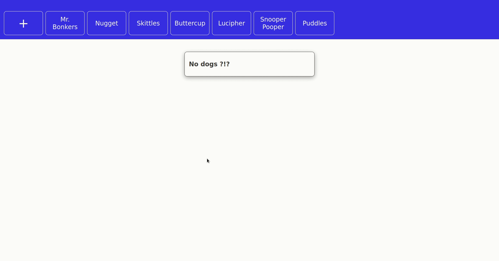

# Dog Owners

In this exercise we practice using events and forms. This is a combo that you will find all the time when writing front-end applications. Your end result should be similar to below:

## Learning Objectives
* Use event listeners to render dynamic content in response to a click event
* Render dynamic content based on the contents of a submitted form 

## Instructions Part 1
- DO NOT MODIFY THE HTML FILE
- Use the provided `index.js` as a starting point.
- You'll find a variable called `data` in the console.log. That's your **list of dogs**
- Render the top list of dogs using the list item template you'll find on the HTML file
- Each list item **should be clickable**. When you click on an item, the selected dog should display on the main card
- The main card should contain all the information from the selected dog. **Follow the template for the main card that you'll find on the HTML file.**
- There should be only **one card at the time** on the screen

## Instructions Part 2
- DO NOT MODIFY THE HTML FILE
- When the plus button is clicked, it should replace the main card with a form to add a new dog to the list. You'll find a template for the form on the HTML page. 
- Once the form is submitted, add the new dog to the beginning of the list, right next to the plus button.
- The data does not need to persist - so, once you refresh the page, it is fine that your newly added data disappears.

## Extended
- The dog card should have a button that toggles for the selected dog between good dog/ bad dog
